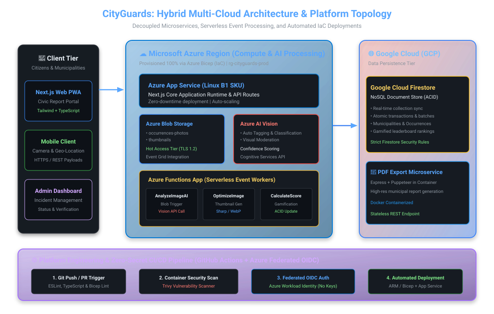
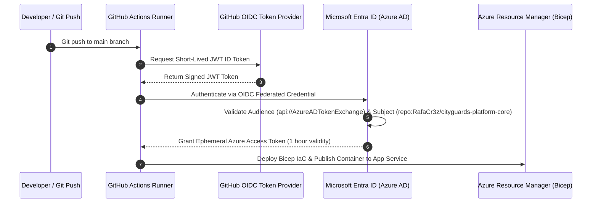
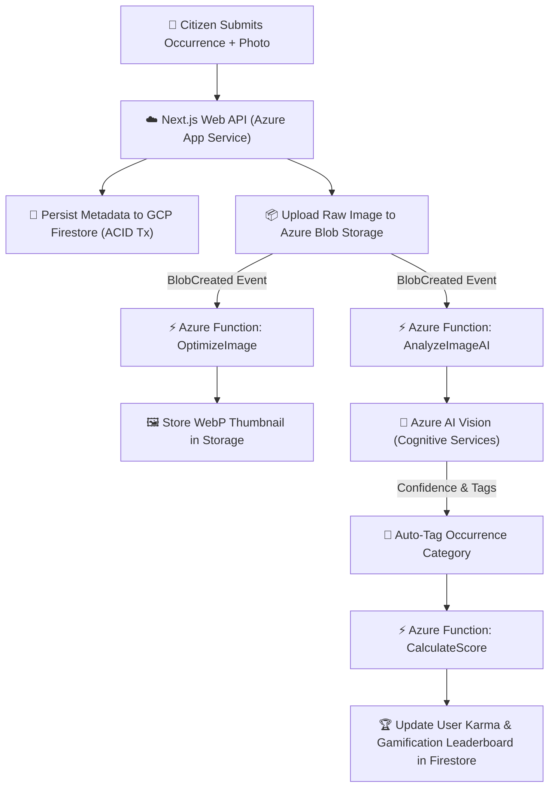

# CityGuards — Multi-Cloud Microservices & IaC Platform

<p align="left">
  
  
  
  
  
  
  
  
</p>

> **Fault-Tolerant Civic Reporting SaaS with Automated Cloud Infrastructure**  
> Modular multi-cloud microservices platform with strict transactional control (**ACID**), serverless event workers, automated **Azure AI Vision** moderation, and 100% Infrastructure as Code (**Azure Bicep**) deployed via **Zero-Secret GitHub Actions OIDC**.

---

## 🏛️ System Architecture & Multi-Cloud Topology

CityGuards implements a resilient, decoupled multi-cloud architecture spanning **Microsoft Azure** (compute, serverless event-driven processing, and media storage) and **Google Cloud Platform** (synchronous ACID state and real-time incident document persistence).

<p align="center">
  
</p>

### 🧩 Core Component Layers

1. **Compute & Ingress (Microsoft Azure):**
   - **Azure App Service (Linux B1 SKU):** Hosts the containerized Next.js 14 web application core, handling server-side rendering (SSR), API routes, and municipal management portals.
   - **Azure Blob Storage (`occurrences-photos` & `thumbnails`):** High-throughput storage tier with TLS 1.2 enforcement for evidence images.
2. **Serverless Event Processing (Azure Functions App):**
   - **`AnalyzeImageAI`:** Triggered upon blob creation; connects to **Azure AI Vision (Cognitive Services)** to extract visual tags, categorize incidents, and perform automated content moderation.
   - **`OptimizeImage`:** Generates high-efficiency WebP thumbnails using Sharp to optimize mobile payload delivery.
   - **`CalculateScore`:** Executes real-time gamification algorithms, computing citizen contribution karma and updating leaderboard rankings with ACID guarantees.
3. **Data Persistence Tier (Google Cloud Firestore):**
   - NoSQL document database providing atomic transaction batching, optimistic concurrency controls, and real-time synchronizations between citizen apps and municipal dashboards.
4. **Microservices (Dockerized Containers):**
   - **`pdf-service`:** Standalone Express microservice packaged in Docker for on-demand generation of formal municipal incident dossiers.

---

## 🏗️ Infrastructure as Code (Azure Bicep)

All cloud infrastructure is strictly codified in modular **Azure Bicep** templates located in [`infra/main.bicep`](infra/main.bicep), eliminating manual configuration drift and enabling deterministic environment provisioning:

```bicep
/* =====================================================================
   CityGuards — Azure Bicep Infrastructure as Code (IaC)
   Provisioned Resources:
   - Azure App Service Plan & Web App (Linux Next.js Runtime)
   - Azure Storage Account (occurrences-photos & thumbnails containers)
   - Azure Cognitive Services (ComputerVision AI moderation)
   - Azure Function App (Serverless Blob Triggered Workers)
   ===================================================================== */

@description('Unique environment prefix for all resource identifiers.')
param prefix string = 'cityguards'

@description('Azure deployment region.')
param location string = resourceGroup().location

@description('App Service SKU tier.')
param appServiceSku string = 'B1'

// Dynamic deterministic resource naming
var uniqueSuffix = uniqueString(resourceGroup().id)
var storageAccountName = '${prefix}store${substring(uniqueSuffix, 0, 6)}'
var appServicePlanName = '${prefix}-asp-${uniqueSuffix}'
var webAppName = '${prefix}-web-${uniqueSuffix}'
var functionAppName = '${prefix}-func-${uniqueSuffix}'
var cognitiveServiceName = '${prefix}-ai-${uniqueSuffix}'

// 1. Storage Account & Containers
resource storageAccount 'Microsoft.Storage/storageAccounts@2022-09-01' = {
  name: storageAccountName
  location: location
  sku: { name: 'Standard_LRS' }
  kind: 'StorageV2'
  properties: {
    accessTier: 'Hot'
    supportsHttpsTrafficOnly: true
    minimumTlsVersion: 'TLS1_2'
  }
}
```

---

## 🔐 Zero-Secret CI/CD Pipeline (GitHub Actions & OIDC)

Security is enforced at the platform level by eliminating long-lived static credentials. The CI/CD pipeline ([`.github/workflows/deploy.yml`](.github/workflows/deploy.yml)) utilizes **Azure Federated OpenID Connect (OIDC)** and Workload Identity to authenticate deployments:



### CI/CD Pipeline Stages:
1. **Quality & Linting:** Automated ESLint and TypeScript compile checks.
2. **IaC Validation:** `az bicep build` syntax verification and ARM template linting.
3. **Container Security Scan:** Vulnerability scanning with **Aqua Security Trivy** blocking critical CVEs.
4. **Federated Cloud Deployment:** Zero-secret infrastructure provisioning via `azure/arm-deploy@v2`.

---

## 🔄 Event-Driven Incident Lifecycle Flow



---

## 📂 Repository Structure

```text
cityguards-platform-core/
│
├── .github/
│   └── workflows/
│       └── deploy.yml             # CI/CD Pipeline: OIDC Auth, Bicep Deploy & Security Scan
│
├── infra/
│   └── main.bicep                 # 100% Codified Azure Cloud Infrastructure
│
├── azure-functions/               # Serverless Event-Driven Workers
│   ├── AnalyzeImageAI/            # Azure AI Vision integration & moderation
│   ├── CalculateScore/            # Gamification algorithm & score calculator
│   └── OptimizeImage/             # Image compression & thumbnail generator
│
├── pdf-service/                   # Containerized PDF Export Microservice
│   ├── Dockerfile                 # Microservice container definition
│   └── server.js                  # PDF rendering engine
│
├── app/                           # Next.js 14 Core Application & API Routes
├── lib/                           # Shared utilities, Firestore client & Azure SDKs
├── public/                        # Static assets & branding
│
├── docs/                          # Architecture diagrams & technical specifications
│   └── architecture.svg           # High-resolution multi-cloud topology diagram
│
├── .dockerignore                  # Docker exclusion rules
├── .env.example                   # Environment configuration template
├── .gitignore                     # Git exclusion rules
├── Dockerfile                     # Main application container image
├── package.json                   # Node.js dependencies
└── README.md                      # Platform documentation
```

---

## 🚀 Getting Started & Local Development

### Prerequisites
* **Node.js:** v20+ LTS
* **Docker & Docker Compose**
* **Azure CLI:** `az` with `bicep` extension
* **Firebase / GCP Account** (for Firestore credentials)

### 1. Clone & Configure Environment
```bash
git clone https://github.com/RafaCr3z/cityguards-platform-core.git
cd cityguards-platform-core
cp .env.example .env.local
```

### 2. Install Dependencies
```bash
npm install
```

### 3. Run Development Server
```bash
npm run dev
```
*Application available at:* `http://localhost:3000`

### 4. Deploy Infrastructure with Azure Bicep
```bash
az login
az group create --name rg-cityguards-dev --location westeurope
az deployment group create \
  --resource-group rg-cityguards-dev \
  --template-file infra/main.bicep \
  --parameters prefix=cityguards appServiceSku=B1
```

---

## 👥 Authors & Acknowledgments

* **Rafael Cruz** — [LinkedIn](https://linkedin.com/in/rafael-cruz-7159092b2) | [GitHub](https://github.com/RafaCr3z)
* **Program:** Poliempreende Regional & Nacional (Instituto Politécnico de Castelo Branco - IPCB)

---
<p align="center">
  <sub>Engineered for reliability, multi-cloud scalability, and automated cloud operations.</sub>
</p>
